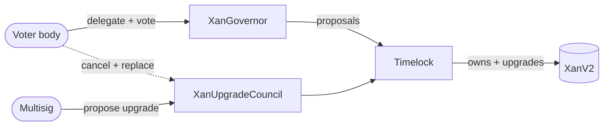

# CONTEXT

> Domain glossary and architecture overview for the Anoma (XAN) token and its governance: the V1→V2 upgrade, linear vesting of formerly-locked balances, `ERC20Votes` governance, and the upgrade council. This is conceptual orientation only — the audit-grade token spec is [docs/XanV2-upgrade.md](docs/XanV2-upgrade.md), the governance reference is [docs/governance.md](docs/governance.md), and the design decisions are the ADRs in [docs/adr/](docs/adr/).

## Architecture

The XAN token is **governance-agnostic**: it trusts a single owner to authorize upgrades and holds no governance logic itself. All meta-governance lives outside the token, in the contracts that hold that owner role. Authority flows from the token holders, through the DAO, to the timelock that owns and upgrades the token:

### Actors

- **XanV2** — the token. Governance-agnostic; its only privileged power is an owner-authorized upgrade. Carries `ERC20Votes` voting power (the full balance, including still-locked vesting tokens), so holders can delegate and vote.
- **Timelock** — owns the token and is the only account that can upgrade it. Every privileged action waits out a delay before anyone may execute it.
- **XanGovernor** — the voter body's instrument: holders delegate and vote, and an accepted proposal is queued through the timelock and then executed.
- **XanUpgradeCouncil** — a multisig-fronted module that can initiate a token upgrade as a backup when the voter body is inactive. It can withdraw its own pending upgrade but holds no power over voter-body operations.

### Interplay

- **Two upgrade paths**, both ending as a timelocked upgrade: a **voter-body proposal**, or a **council-initiated upgrade**. The council path is *slower*, not faster — it sits in a window longer than a voter proposal, so the voter body always has time to cancel it; its value is liveness (it works when the voter body cannot reach quorum), not speed.
- **One-way cancel**: the voter body can cancel the council's upgrade through a governor proposal, and the council can withdraw its own pending upgrade — but the council cannot cancel voter-body operations. Cancelling only blocks — no funds can move this way.
- **Voter supremacy**: the voter body can cancel the council's upgrades, replace the council, and revoke the module's powers; the council holds no reciprocal check over the voter body. The one gap is an **inactive voter body** — the scenario the council exists for — where the council's long delay and off-chain monitoring are the only checks.

## Glossary

### Actors

**XanV2** (the token): The upgradeable ERC-20 / `ERC20Votes` token. Governance-agnostic — its only privileged power is an owner-authorized upgrade. Voting power tracks the full balance, including locked vesting tokens.

**XanGovernor**: The OpenZeppelin `Governor` DAO driven by the token's votes; the voter body's on-chain instrument. Power: propose, tally votes (quorum plus a `For` majority), and queue and execute accepted proposals through the timelock.

**XanUpgradeCouncil**: The upgrade council's on-chain module. Powers: initiate a token upgrade (upgrades-only, one at a time) as a backup for an inactive voter body — the upgrade takes longer than a voter proposal, so the voter body can cancel it — and withdraw its own pending upgrade. It holds no power over voter-body operations. Subordinate to the voter body, which alone can rotate the council. Distinct from V1's defunct in-token `governanceCouncil`.

**Timelock** (`TimelockController`): The OpenZeppelin timelock that owns the token and executes accepted operations after a delay. Anyone may execute once the delay elapses; it self-administers, so its roles change only through governance.

### Token & vesting

**Principal**: The amount an account had locked under XAN V1 — its locked tranche from the distribution, received via `transferAndLock`. In V2 the principal vests linearly; it is fixed per account and never increases.

**Locked balance** (`lockedBalanceOf`): The still-locked, non-transferable part of an account's principal: `principal − unlocked`. Reaches zero once the principal has fully vested and been unlocked.

**Unlocked balance** (`unlockedBalanceOf`): The spendable part of an account's balance: `balanceOf − lockedBalance`. Only this part may be transferred.

**Vested amount**: The portion of an account's principal that has vested by a given time — `0` before the start, the full principal at or after the end, and linear in between. A function of time alone, independent of what has been unlocked.

**Unlockable balance** (`unlockableBalanceOf`): What `unlock()` would move from locked to unlocked right now: `max(0, vested − unlocked)`.

**Unlock** (`unlock`): The action by which an account moves its currently unlockable (vested-but-not-yet-unlocked) tokens from its locked to its unlocked balance, making them spendable. Does not change `balanceOf` and moves no tokens between accounts.

**Vesting schedule**: The linear schedule over which principals vest, from `VESTING_START` to `VESTING_START + VESTING_DURATION` (the vesting end). Identical for every account and baked into the V2 implementation; there is no cliff.

### Upgrade

**Reinitialization** (`reinitializeFromV1`): The one-time, argument-free call run when the proxy is upgraded from V1 to V2: it initializes `ERC20Votes` and ownership, seeds the voting total-supply checkpoint, and emits the vesting schedule. Executable permissionlessly once the upgrade is scheduled; the owner and schedule are baked into the implementation, never passed in.

### Governance

**Voter body**: The token holders exercising delegated `ERC20Votes` voting power — the V2-era electorate that drives `XanGovernor`. V1's quorum-locking-and-voting mechanism is its now-defunct predecessor.
