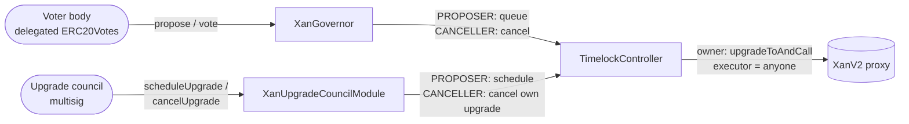
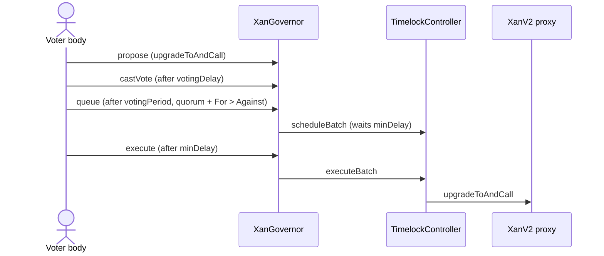
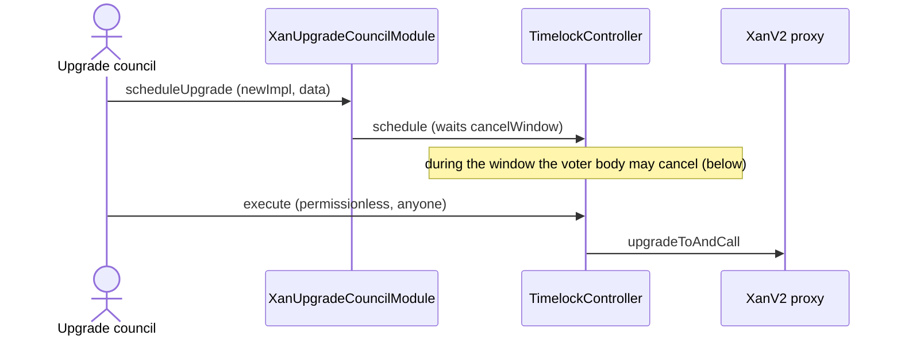
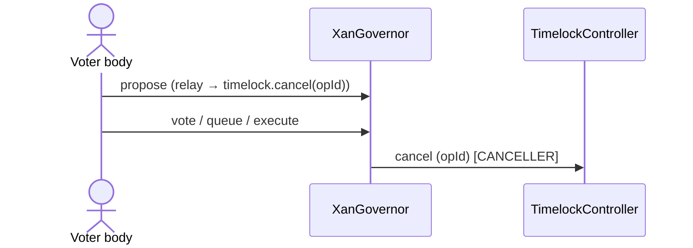

# XAN Governance — Architecture & Reference

This document specifies the **governance layer** that owns and upgrades the `XanV2` token: the `XanGovernor` DAO, its `TimelockController`, and the `XanUpgradeCouncilModule`. It is the audit-facing counterpart to [`01-XanV2-upgrade.md`](./01-XanV2-upgrade.md) (which specifies the token itself and treats governance as out of scope). The domain vocabulary lives in [`../CONTEXT.md`](../CONTEXT.md).

The token is **governance-agnostic**: it trusts a single `owner()` to authorize UUPS upgrades and nothing else. Everything below lives _outside_ the token, in the contracts that hold that owner role.

## 1. Actors

- **XanV2** — the ERC-20 / `ERC20Votes` token. Owner-only UUPS-upgradeable; voting power tracks the full balance (including locked, vesting principal) on a timestamp clock. It holds no governance logic of its own.
- **TimelockController** (OpenZeppelin) — **owns** the token (`token.owner() == timelock`) and is the only address that upgrades it. Every privileged action is a timelock operation that waits out a delay before it can execute.
- **XanGovernor** — an OpenZeppelin `Governor` driven by the token's votes. It is the **voter body's** instrument: the electorate proposes, votes, and (on success) queues operations into the timelock.
- **XanUpgradeCouncilModule** — a module fronting a Safe multisig (the _upgrade council_). A backup upgrade path for when the voter body is inactive; it can withdraw its own pending upgrade but holds no power over voter-body operations. Its council is fixed for the module's lifetime.

The authority spine and power flow:



## 2. Ownership & role wiring

The timelock is deployed with `minDelay = DELAY_DURATION`, no preset proposers/executors, and the deployer as a temporary admin. Roles are then wired and the deployer's admin is dropped (see `PrepareXanV2Upgrade.deployGovernance`):

| Timelock role        | Holder(s)                                | Meaning                                                     |
| -------------------- | ---------------------------------------- | ----------------------------------------------------------- |
| `PROPOSER_ROLE`      | `XanGovernor`, `XanUpgradeCouncilModule` | May schedule operations                                     |
| `CANCELLER_ROLE`     | `XanGovernor`, `XanUpgradeCouncilModule` | May cancel pending operations                               |
| `EXECUTOR_ROLE`      | `address(0)` (open)                      | **Anyone** may execute once the delay elapses               |
| `DEFAULT_ADMIN_ROLE` | the timelock itself                      | Deployer renounces it; roles change only through governance |

Because the executor is open, execution is permissionless; authority lives entirely in _who may schedule and cancel_. Because the admin is the timelock, the role set can only be changed by a passed governance operation — so the voter body can, in the last resort, revoke the council module's roles entirely.

## 3. XanGovernor

A stock OpenZeppelin `Governor` composed of `GovernorSettings`, `GovernorCountingSimple`, `GovernorVotes`, `GovernorVotesQuorumFraction`, and `GovernorTimelockControl` — no bespoke powers. It reads voting power from the token's `ERC20Votes` checkpoints on the **timestamp** clock (EIP-6372), so its settings are denominated in seconds. It **pins its own `clock()`/`CLOCK_MODE()` to the timestamp clock** instead of inheriting `GovernorVotes`'s token-tracking fallback: the governor is deployed before the upgrade, while the token is still XanV1 (no EIP-6372 clock), so pinning keeps its quorum-numerator checkpoint timestamp-keyed from construction and matches XanV2 once live.

- **Counting** (`GovernorCountingSimple`): `Against` / `For` / `Abstain`. Quorum is reached when `For + Abstain ≥ quorum`; a proposal succeeds when quorum is reached **and** `For > Against`.
- **Quorum**: `quorum(t) = getPastTotalSupply(t) · QUORUM_RATIO` = **50%** of the voting supply.
- **Settings**: `votingDelay = VOTING_DELAY`, `votingPeriod = VOTING_PERIOD`, `proposalThreshold = PROPOSAL_THRESHOLD` (see section [Parameters](#9-parameters)).
- **Timelock control**: a succeeded proposal is `queue`d into the timelock and `execute`d after `minDelay`; the governor holds the timelock's `PROPOSER` and `CANCELLER` roles.

## 4. XanUpgradeCouncilModule

The module holds the timelock's `PROPOSER` and `CANCELLER` roles and **never owns the token**. Its single authority is the **council multisig**, set at deployment as an immutable (`_COUNCIL`, read via `getCouncil()`) and guarded by one modifier, `onlyCouncil`. The module exposes a small, deliberately narrow set of powers:

- **`scheduleUpgrade(newImplementation, data)`** (council-gated) — the council's _only_ propose power. It builds a single `upgradeToAndCall` on the token and schedules it in the timelock with `delay = cancelWindow()` and a deterministic, council-tagged salt. Only **one** council upgrade may be in flight at a time.
- **`cancelUpgrade()`** (council-gated) — withdraws the module's **own pending upgrade** from the timelock. The module only ever aims its `CANCELLER` role at the operation it scheduled itself; the council has **no cancel power over voter-body operations**.

**Immutable council.** The module has no rotation function. A Safe changes its own signers internally without changing its address, so most membership changes need no on-chain action. Changing the multisig _address_ means deploying a fresh module, granting it the timelock roles, and revoking the old module's — all through voter-body proposals (see section [Ownership & role wiring](#2-ownership--role-wiring)). That same role-revocation is the disarm path for a captured council, so nothing is lost by dropping on-chain rotation.

**Cancel window.** The `scheduleUpgrade` delay is computed live so it always outlasts a full voter-cancel cycle even if governor settings change:

```
cancelWindow = votingDelay + votingPeriod + timelock.getMinDelay() + COUNCIL_CANCEL_BUFFER
```

With the parameters in the [Parameters](#9-parameters) section this is `7d + 14d + 14d + 7d = 42 days`.

## 5. Upgrade paths

Both paths land as a timelocked `upgradeToAndCall` executed by the timelock (the owner).

### Voter-body upgrade - the standard OpenZeppelin flow:



### Council upgrade — a backup for an inactive voter body:



The council upgrade window (see section [XanUpgradeCouncilModule](#4-xanupgradecouncilmodule)) is longer than a voter-body upgrade (~35 days) and deliberately exceeds a full voter-cancel cycle, so the voter body can always cancel it. Its value is liveness — it works when the voter body cannot reach quorum — not speed.

## 6. Cancellation

Cancellation is **one-way**: the voter body can cancel the council's pending upgrade, while the council can withdraw only its own.

- **Council withdraws its own upgrade** — `council → XanUpgradeCouncilModule.cancelUpgrade()`. The module cancels the operation it scheduled itself and can aim its `CANCELLER` role at nothing else.
- **Voter body cancels a council upgrade** — a `XanGovernor` proposal that relays `TimelockController.cancel(operationId)` through the governor (which holds `CANCELLER`):



## 7. Voter supremacy

The voter body sits above the council structurally, not just per-upgrade:

- It can **cancel** any council upgrade within the cancel window (see section [Cancellation](#6-cancellation)).
- It can **replace** the council by revoking the module's timelock roles (see section [Ownership & role wiring](#2-ownership--role-wiring)) and wiring a fresh module with a new multisig — all through proposals; the council has no cancel power over voter-body operations, so it **cannot** block its own replacement.
- It can **revoke** the module's timelock roles outright (the timelock self-administers; see section [Ownership & role wiring](#2-ownership--role-wiring)).

The irreducible exception is an **inactive voter body**: when the electorate genuinely cannot reach quorum it also cannot cancel or replace the council, so in exactly the scenario the council exists for, the council is checked only by the delay window and off-chain monitoring — the layer's central trust assumption.

## 8. Trust assumptions

- **Inactive-voter honeypot (irreducible).** See section [Voter supremacy](#7-voter-supremacy). Bounded by the delay and by voters later replacing the council.
- **A passed voter-body proposal is on-chain-unstoppable.** No actor holds a cancel over queued voter-body operations; the residual defense against a captured voter body is off-chain, within the timelock delay. Accepted on capture-cost grounds.
- **A captured council is nearly powerless.** It can only schedule token upgrades — slower than a voter cycle and cancellable by the voter body — and withdraw its own pending one; it cannot cancel, stall, or veto voter-body operations. The backstop is council replacement / module revocation.
- **One council upgrade in flight.** The module refuses a new council upgrade while one is pending; competing voter-body upgrades are unaffected, and the token's `reinitializer` version guard prevents a stale op from re-running.
- **The council delay is deliberately long** (a full voter-cancel cycle + buffer), computed live so the timing invariant cannot silently break when governor settings change.

## 9. Parameters

| Constant                                | Value          | Used for                                                                         |
| --------------------------------------- | -------------- | -------------------------------------------------------------------------------- |
| `VOTING_DELAY`                          | `7 days`       | Governor `votingDelay`                                                           |
| `VOTING_PERIOD`                         | `14 days`      | Governor `votingPeriod`                                                          |
| `PROPOSAL_THRESHOLD`                    | `1e18` (1 XAN) | Governor `proposalThreshold`                                                     |
| `QUORUM_RATIO_NUMERATOR / _DENOMINATOR` | `1 / 2` (50%)  | Governor quorum fraction                                                         |
| `DELAY_DURATION`                        | `14 days`      | Timelock `minDelay`                                                              |
| `COUNCIL_CANCEL_BUFFER`                 | `7 days`       | Cancel-window margin (see [XanUpgradeCouncilModule](#4-xanupgradecouncilmodule)) |
| Cancel window (derived)                 | `42 days`      | Council upgrade delay                                                            |
