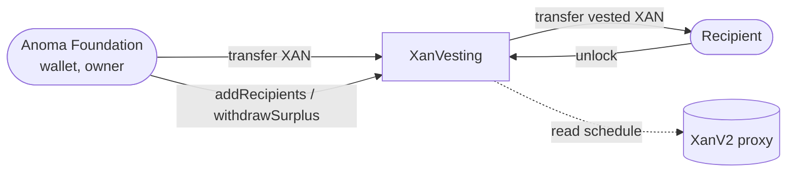

# XanVesting — Specification & Architecture

This document specifies `XanVesting`, the contract that vests XAN for eligible recipients whose addresses the genesis distribution of XAN V1 did not contain. It copies the vesting schedule and the unlock mechanism of the token, which [`01-XanV2-upgrade.md`](./01-XanV2-upgrade.md) specifies, and it lives outside the governance layer of [`02-XanV2-governance.md`](./02-XanV2-governance.md). The domain vocabulary lives in [`../CONTEXT.md`](../CONTEXT.md).

## 1. Purpose

The genesis distribution of XAN V1 gave each eligible recipient that submitted an address its locked tranche, through the Merkle `TokenDistributor` and `transferAndLock`. A few eligible recipients did not submit an address, so the distribution does not contain them. `XanV2` vests only the principals that V1 recorded (see section [Vesting](./01-XanV2-upgrade.md#4-vesting)), so it cannot vest their tranches.

The Anoma Foundation holds these tranches. It moves them into `XanVesting`, and each recipient unlocks its tranche there over time, on the same schedule and with the same `unlock()` as the holders in the token. A principal is the locked tranche that the recipient missed; if the recipient was also owed a liquid tranche, the foundation sends that directly with an ordinary transfer.

**No new tokens.** `XanV2` cannot mint, so the supply stays fixed. `XanVesting` only passes existing XAN from the foundation to the recipients.

## 2. Architecture



`XanVesting` is not upgradeable and inherits OpenZeppelin `Ownable`. It holds its XAN like any other account, and `unlock()` pays recipients with ordinary token transfers. Besides its own balance, it reads only the vesting schedule from the XAN token, once, at construction.

It exposes the vesting interface of `IXanV2` except `implementation()` and `initialOwner()`, and it reuses the `VestingScheduled` and `Unlocked` events of `IXanV2` and the `NothingToUnlock` error of `XanV2`.

## 3. Domain model & balances

The relationships mirror those of `XanV2` (see section [Domain model & balances](./01-XanV2-upgrade.md#3-domain-model--balances)), with the principal in place of the token balance:

- `principalOf` — the principal that the owner added; fixed once added
- `lockedBalanceOf = principal − unlocked[account]` — the part of the principal not unlocked yet
- `unlockedBalanceOf = unlocked[account]` — the part that the contract has transferred to the account
- `unlockableBalanceOf = max(0, vested(principal) − unlocked[account])` — what `unlock()` would transfer now
- `principalOf = lockedBalanceOf + unlockedBalanceOf`

**`unlockedBalanceOf` differs from `XanV2`.** In `XanV2`, it is the spendable balance, `balanceOf − lockedBalanceOf`. `XanVesting` holds no balance per account, because unlocked XAN leaves the contract, so it returns the amount transferred so far. The transferred XAN is freely transferable in the token, like any XAN that an account receives.

Three totals cover all recipients:

- `totalPrincipal()` — the sum of all principals
- `totalLockedBalance()` — the sum of all locked balances: the XAN that the contract must hold to pay every remaining unlock
- `totalUnlockableBalance()` — the XAN that the contract must hold now so that every recipient can unlock: `vested(totalPrincipal) − Σ unlocked`, which exceeds the sum of the unlockable balances by at most 1 wei per recipient

## 4. Vesting

**Schedule.** The constructor copies `vestingStart()` and `vestingEnd()` from the XAN token into immutables, so every recipient vests on the schedule of `XanV2` (see section [Vesting](./01-XanV2-upgrade.md#4-vesting)):

```
vested(principal) = 0                                                               if now ≤ vestingStart
                  = principal                                                       if now ≥ vestingEnd
                  = principal · (now − vestingStart) / (vestingEnd − vestingStart)  otherwise
```

A recipient added after `vestingStart` can unlock the part that has already vested at once.

**`unlock()`.** Works as in `XanV2`: it raises the cumulative `unlocked[msg.sender]` to `vested(principal)` and reverts `NothingToUnlock` if nothing new has vested. It then transfers the difference from the XAN balance of the contract to the caller and emits `Unlocked`. If the balance is too low, it reverts `TokenBalanceInsufficient` and records nothing (see section [Funding](#6-funding)). It acts only for `msg.sender`, so a recipient calls it from the address that has the principal.

**Rounding.** As in `XanV2`: integer division under-vests by at most a dust amount mid-schedule, and at or after `vestingEnd` the full principal vests.

## 5. Recipients

The constructor adds the initial recipients, and the owner adds more in batches with `addRecipients(Recipient[])`. A `Recipient` is an `account` and its `principal`. The list is append-only: a principal cannot change and cannot be removed. An entry reverts the whole batch if:

- the account is the zero address (`ZeroAccountNotAllowed`), or the principal is zero (`ZeroPrincipalNotAllowed`);
- the account is `XanVesting` itself (`SelfRecipientNotAllowed`) or the XAN token (`TokenRecipientNotAllowed`), neither of which can call `unlock()`;
- the account already has a principal here (`PrincipalAlreadySet`).

Each added principal emits `PrincipalAdded`. `getRecipients()` returns all recipients with their principals, in the order of addition.

An account can also have a principal in the XAN token. The two principals vest independently, and `XanVesting` does not read the one in the token.

## 6. Funding

The Anoma Foundation funds the contract with ordinary XAN transfers; the contract has no deposit function. The owner can add principals before the XAN arrives, so the contract can hold less than `totalLockedBalance()` for a time. This is accepted:

- **Underfunded.** An `unlock()` that needs more XAN than the contract holds reverts `TokenBalanceInsufficient` and records nothing. The recipient keeps its unlockable amount and calls again after the next top-up, so no vesting is lost. While the balance is low, the unlocks that land first are paid first.
- **Top-ups.** The foundation tops up the contract periodically, so that vesting continues and recipients can unlock (see [Top-up amount](#top-up-amount)).
- **Surplus.** `withdrawSurplus(receiver, value)` lets the owner take the XAN above `totalLockedBalance()`, for example after an overpayment, and emits `SurplusWithdrawn`. A larger `value` reverts `SurplusInsufficient`, so `withdrawSurplus` cannot take XAN that a locked balance needs.

### Top-up amount

Two scripts compute the XAN to send now, from the live state of `XanVesting` and the XAN token. Both send nothing, return zero when the balance is already enough, and cover the recipients added so far:

- `script/ComputeXanVestingTopUpUntil.s.sol` covers every unlock until a timestamp, usually the time of the next top-up. It reads `totalUnlockableBalance()` at that timestamp. Run it with `just vesting-top-up-until <xan-vesting> <timestamp> <chain>`.
- `script/ComputeXanVestingTopUpFull.s.sol` covers every present and future unlock. Run it with `just vesting-top-up-full <xan-vesting> <chain>`.

For example, 3,650,000 XAN of principals vest about 3,333 XAN per day, so a top-up until 30 days from now adds about 100,000 XAN to what recipients can unlock now.

## 7. Voting

`XanVesting` holds the locked XAN and cannot delegate it, so a locked principal has no voting power. This differs from `XanV2`, where voting power includes the locked principal (see [ADR-03](./adr/03-voting-power-tracks-full-balance.md)). A recipient votes only with XAN that it has unlocked and delegated. The XAN in `XanVesting` still counts toward the total supply that sets the quorum (see section [XanGovernor](./02-XanV2-governance.md#3-xangovernor)), but no one can cast its votes. This is accepted (see [ADR-09](./adr/09-locked-xanvesting-principals-carry-no-voting-power.md)).

## 8. Integration

A client checks both contracts for an account, because an account can have a principal in each (see section [Recipients](#5-recipients)). If `principalOf(account)` on `XanVesting` is non-zero, it calls `unlock()` and the views on `XanVesting`; if `principalOf(account)` on the XAN token proxy is non-zero, it calls them on the proxy. Only `unlockedBalanceOf` means something different on the two contracts (see section [Domain model & balances](#3-domain-model--balances)).

## 9. Ownership

The owner is the Anoma Foundation wallet, which funds the contract (see [ADR-10](./adr/10-the-anoma-foundation-wallet-owns-xanvesting.md)), which the deployment passes as `initialOwner`. The owner can add recipients, withdraw the surplus, and transfer or renounce ownership (`Ownable`). It cannot change or remove a principal, and it cannot unlock for a recipient. The voter body has no power over `XanVesting`. The contract has no proxy, so a change to its code needs a new deployment.

## 10. Trust assumptions

- **The owner adds only eligible recipients with their correct principals.** All principals draw on one XAN balance. A principal that the foundation does not fund, such as an oversized one, takes XAN that backs the other recipients when it unlocks, and it cannot be removed. The owner, the Anoma Foundation wallet, is trusted to add only principals that it funds (see [ADR-10](./adr/10-the-anoma-foundation-wallet-owns-xanvesting.md)); `withdrawSurplus` alone cannot take XAN that a locked balance needs. The contract does not read the principals in the XAN token, so the owner must also make sure that a principal does not repeat a tranche that the account already vests there.
- **The foundation keeps the contract funded.** Unlocks depend on its top-ups. An underfunded contract delays unlocks but loses no vesting.
- **A principal leaves the contract only through `unlock()` by its account.** `withdrawSurplus` cannot take it. A principal for an address that can never call `unlock()`, such as a wrong address or a lost key, stays in the contract. So each recipient proves control of its address before it is added (see [DEPLOYMENT.md](../DEPLOYMENT.md#5-xanvesting)).
- **The schedule is fixed at deployment.** A later token upgrade that changes the schedule of the token does not change the schedule of `XanVesting`.
- **Locked principals do not vote.** See section [Voting](#7-voting).
- **No external audit.** `XanVesting` relies on its tests, an internal security review, and the linters; unlike the other contracts in this repository, no external auditor has reviewed it.

## 11. Deployment

`script/DeployXanVesting.s.sol` (`just deploy-vesting-simulate`, then `just deploy-vesting`) takes the XAN token proxy, the owner, and the path of a JSON file in `script/input/` with the initial recipients:

```json
{ "recipients": [{ "account": "0x…", "principal": "1000000000000000000" }] }
```

Principals are decimal strings in the smallest unit (18 decimals). Every recipient has proved control of its address beforehand (see [DEPLOYMENT.md](../DEPLOYMENT.md#5-xanvesting)). After the deployment, the foundation transfers the XAN.

## 12. Parameters

| Getter           | Source                       | Mainnet                                                                                         |
| ---------------- | ---------------------------- | ----------------------------------------------------------------------------------------------- |
| `XAN_TOKEN()`    | constructor                  | `0xCEDbEA37C8872c4171259Cdfd5255CB8923Cf8e7`                                                    |
| `vestingStart()` | XAN token, at construction   | `1790683200` (2026-09-29 12:00 UTC)                                                             |
| `vestingEnd()`   | XAN token, at construction   | `1885291200` (2029-09-28 12:00 UTC)                                                             |
| `owner()`        | constructor (`initialOwner`) | the Anoma Foundation wallet ([ADR-10](./adr/10-the-anoma-foundation-wallet-owns-xanvesting.md)) |
